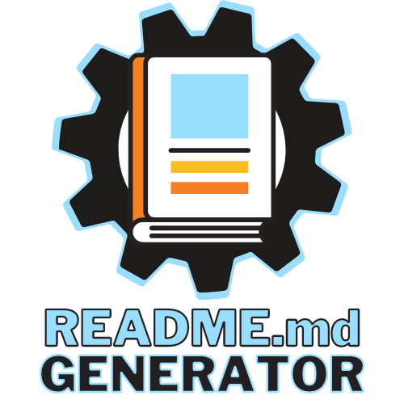

  <!-- PROJECT LOGO -->
   
  

    

  
  <h2 align="center">README Generator</h2>

  > README.md generated by README-Generator App powered by Node.js
  
 Project ID: 599633277

  

  
  
   

  

  You can quickly and easily create a README file by using a command-line application to generate one. This allows the project creator to devote more time to working on the project.
     
     
    <a href="https://github.com/RaulMaya/README-Generator">Repository</a>    
    ·
    <a href="https://github.com/RaulMaya">Owner Github</a>
    ·
    <a href="https://www.linkedin.com/in/raul-maya/">My LinkedIn</a>
  

## :bookmark_tabs: Menu
* [Overview](#overview)
* [Installation](#installation)
* [Usage](#usage)
* [License](#license)
* [Contributing](#contributing)
* [Tests](#test)
* [Contact](#contact)

## Overview

|Key|Value|
|:---:|:---:|
|Created On:|Thu Feb 09 2023 08:58:22 GMT-0600 (Central Standard Time)|
|Last Update:|Thu Feb 09 2023 10:01:22 GMT-0600 (Central Standard Time)|
|Main Language:|JavaScript|
|Size:|158 kB|
|Starred:|0 Stars|
|Forks:|0 Forks|

Description: You can quickly and easily create a README file by using a command-line application to generate one. This allows the project creator to devote more time to working on the project.. The application will help the users, to create an skeleton of a readme.md file, by answering some questions in the terminal.

## Installation

`npm install`

## Usage

This application will be used to generate automatically a READ.md file.

## License

MIT License

  

About the license:

A short and simple permissive license with conditions only requiring preservation of copyright and license notices. Licensed works, modifications, and larger works may be distributed under different terms and without source code.

## Contributing

1. Clone repo and create a new branch: $ git checkout https://github.com/RaulMaya/README-Generator -b <name_for_new_branch.
2. Make changes and test
3. Submit Pull Request with comprehensive description of changes

## Tests

<code>npm run test</code>

## Video

 <video controls>
  <source src="assets/video/howitworks.mp4" type="video/mp4">
</video> 

## Contact

* Username: RaulMaya 

* Name: Raul Maya Salazar

* Email: <raulmayas20@gmail.com>

* Phone: 8331597006

* URL: https://github.com/RaulMaya/README-Generator

* LinkedIn: https://www.linkedin.com/in/raul-maya/

  